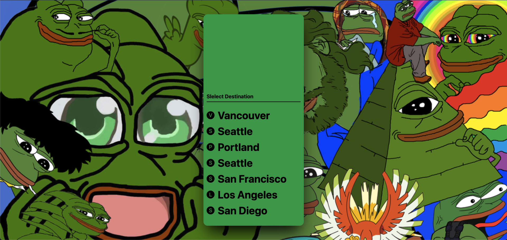
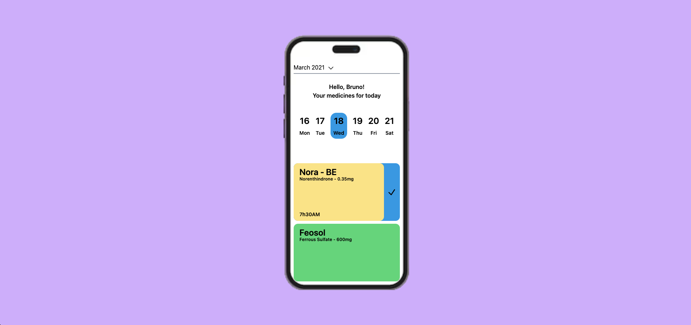

# nomadcoder-react-study-4th_NextJS_tailwind_practice

nomadcoder-react-study-4th_NextJS_tailwind_practice

# Requirements

-   No need to make the phone, just the screen.
-   Use :hover
-   'Tailwind Play'사용할때. 'class'를 사용하세요. 'className' 말고. 'class'를 사용하세요.
-   완료 후. 'Share' 를 클릭하고. 해당 Share용 URL 를 제출하세요.
-   아이콘을 쓰고 싶다면 여기 웹사이트 아이콘: https://heroicons.dev/ 사용하세요.

# Result URL

-   https://play.tailwindcss.com/n9lXpdgr12

# Result2 URL

-   https://play.tailwindcss.com/SRTox9dmUg

